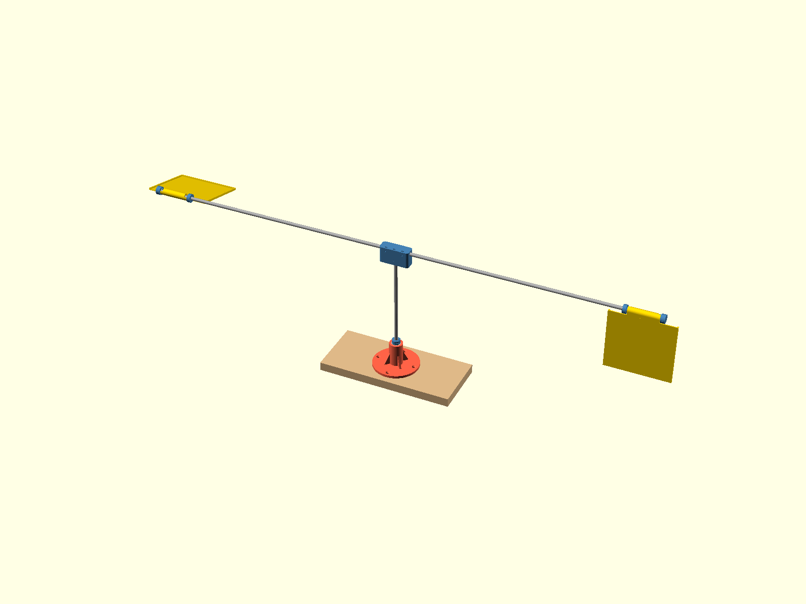

# Skua

A wind-driven gull scarer for a boat, named for the bird that chases
gulls away. A 1.2 m rotor of flapping plastic flags spins on a
plank-mounted bearing tower; the motion and the clatter keep gulls off.
No electronics, no motor — wind only.

## How it works

Each vane hangs from its arm on a free-spinning sleeve, like a flag on a
pole. The end cap's pin rides in a notch in the sleeve, so the vane
swings freely through about 120 degrees one way and hits a hard stop the
other way. Wind pushing a vane toward its stop gets the full panel face
and drags the rotor around; wind pushing the other vane (coming back
upwind) just folds it flat. Both stops point the same way around, so the
torques add and the rotor self-starts in any wind direction. Every pass
the driving vane bangs against its stop — free percussion.

The rotor rides on two 608 skateboard bearings spaced 45 mm apart in the
base tower, so the 1.2 m span runs true. All rotating weight hangs on a
collar clamped to the shaft, resting on the top bearing's inner race.

## Bill of materials

- printed: 1 base, 1 hub, 2 vanes, 2 end caps, 3 collars (see `stl/`)
- 2x 608 bearing (8x22x7 — any skateboard bearing, shielded preferred)
- 8 mm aluminum rod: 1x 300 mm (shaft), 2x 600 mm (arms)
- 3x M3x12 screw + nut, 2x M3x8 screw (end caps, self-tapping)
- 4x 4.2 mm wood screws, and a plank to screw the base onto

## Calibration before printing the real parts

Printers and filaments vary; the three fits are measured, not guessed:

1. Print `stl/bearing_pocket_gauge.stl`, press a bearing into each ring,
   put the number of the firm-but-not-brutal one into `bearing_press_d`
   in `cad/design_params.scad`.
2. Print `stl/rod_fit_gauge.stl`, push the rod through the holes. The
   one it presses into firmly is `rod_snug_d`; the smallest one it spins
   in without grabbing is `rod_free_d`.
3. `python3 scripts/regen_all.py` and print the real parts.

## Assembly

1. Press one bearing into the top of the tower and one into the pocket
   underneath. Screw the base to the plank (the plank keeps the bottom
   bearing captive).
2. Drop the shaft through both bearings. Clamp a collar onto it, boss
   DOWN, so the boss rests on the top bearing's inner race and the shaft
   tip hovers just above the plank.
3. Clamp the hub onto the shaft top (set screw against the rod; the nut
   drops into the slot in the hub's top face). Seat both arms fully in
   their sockets — they bottom out on the center web — and clamp them.
4. On each arm: slide on a collar (boss outboard), then the vane sleeve,
   then the end cap, pin inboard, engaging the sleeve notch. Leave the
   vane about a millimeter of sideways play.
5. Set the stops: hold the vane hanging straight down, rotate each cap
   so its pin just touches the notch wall on the SAME rotational side of
   the rotor for both vanes (viewed from outside the arm tip, one cap is
   set clockwise, the other counterclockwise), then tighten the cap
   screws. Each vane must swing freely one way and stop at hanging the
   other way.
6. Spin it by hand: it should coast freely and the vanes should clack
   against their stops. Then let the wind take over.

## Working on the design

CAD is OpenSCAD, rendered headlessly through nix; derived artifacts are
regenerated by one command and gated before commit:

- `python3 scripts/regen_all.py` after any .scad change
- `python3 scripts/regen_all.py --check` before any commit

See `CLAUDE.md` for the full workflow and design rules.
