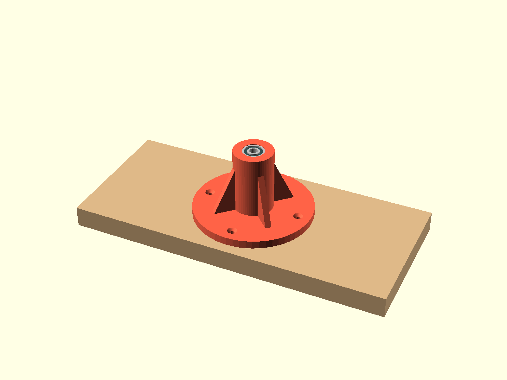
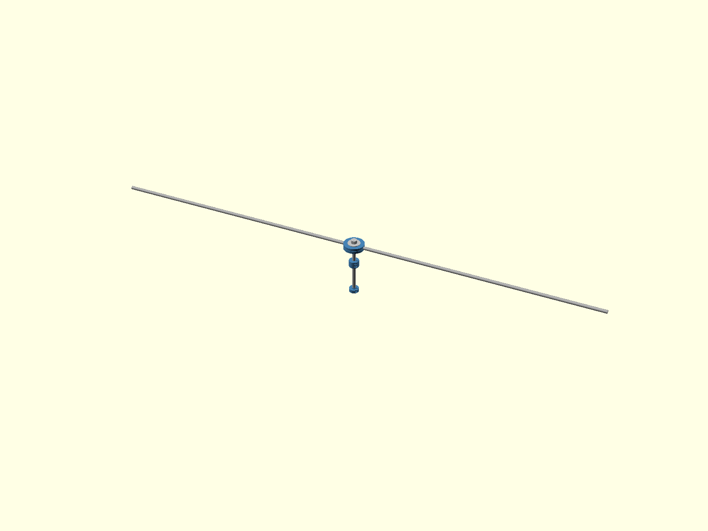
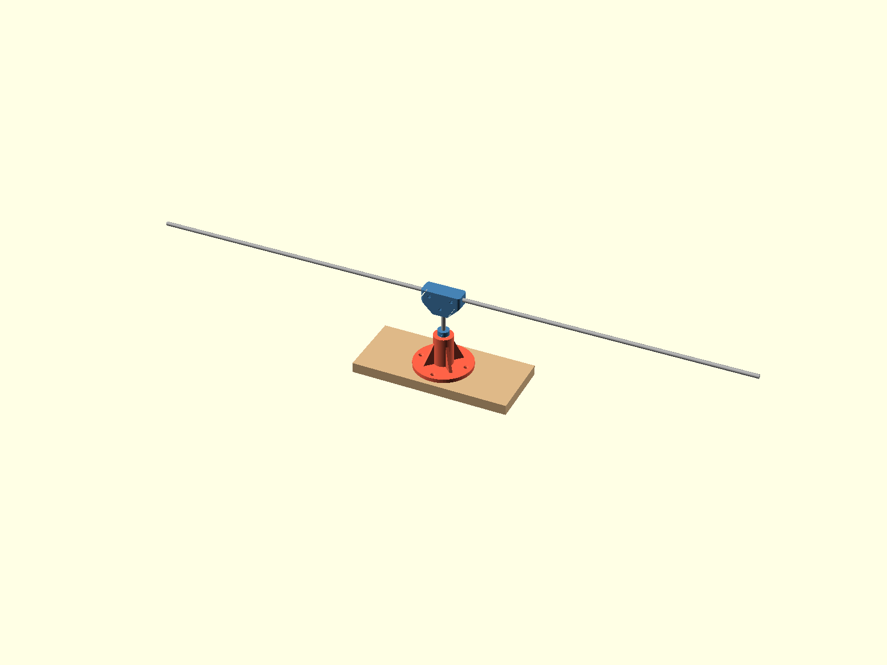
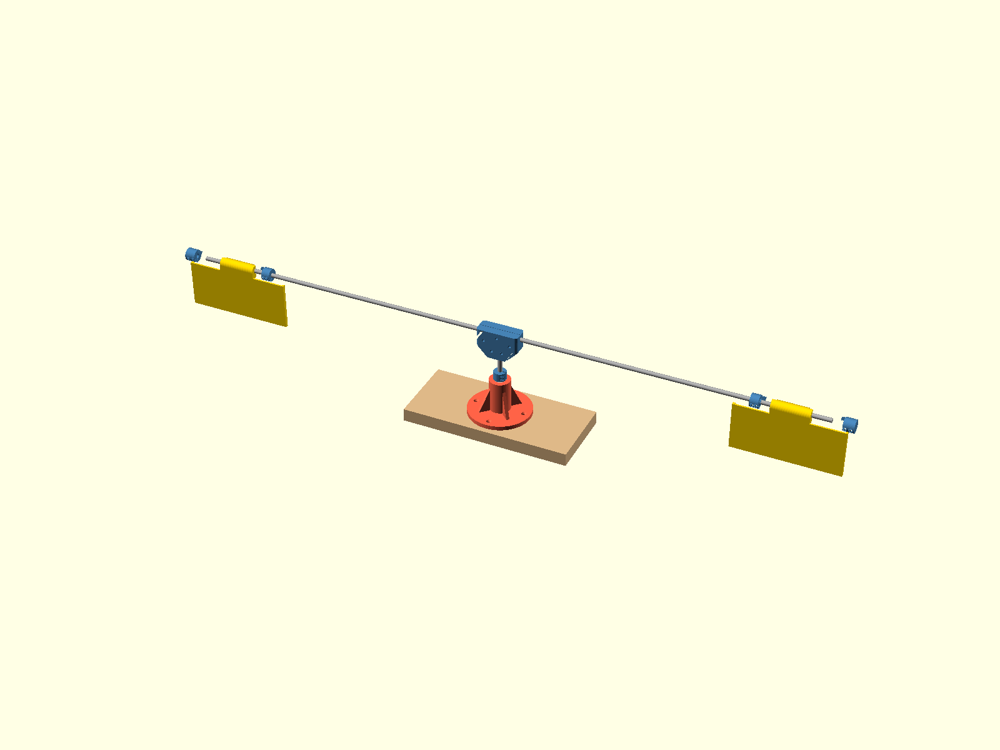
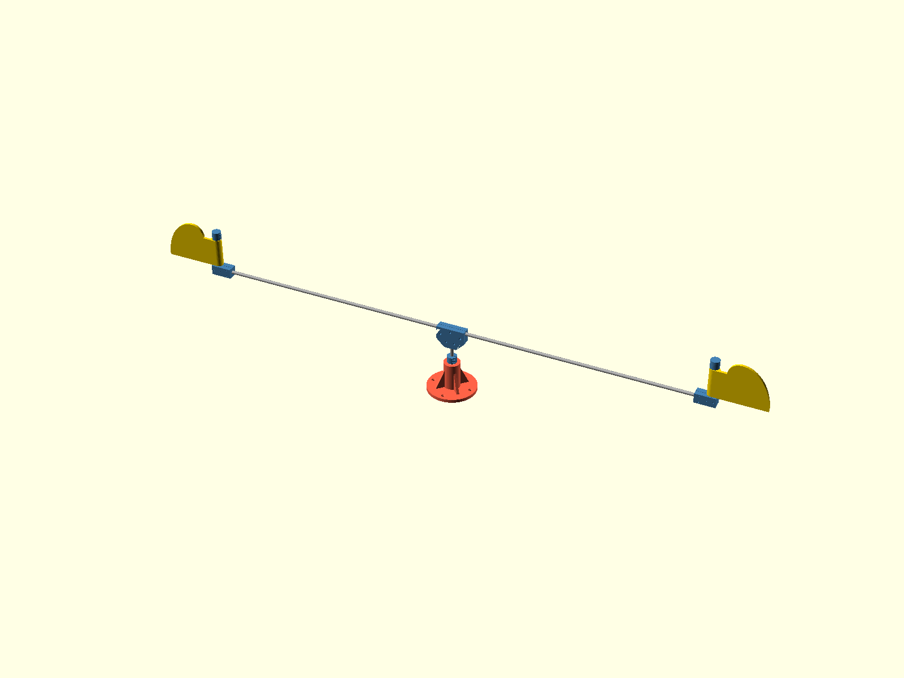

# Assembly guide

What you need at the bench: the printed parts (see the BOM in the
README), the two 608 bearings, the five rod pieces (1x 145 mm, 2x
600 mm, 2x 112 mm of 8 mm aluminum), the two PTFE washers (8x14x1,
the vane thrust seats), an M8x1.25 hand die with its stock, a vice
and the two printed die jig halves to hold the shaft in it, the two
M8 nylocs and fender washers for the hub, the M3 bolts with nyloc
nuts, four wood screws, screwdrivers or hex keys to suit, a 13 mm
wrench or socket for the M8 nuts, and, only if you fit the optional
retainer, something about 1 mm thick and no wider than about 15 mm
(a strip of folded business card, a feeler gauge) for gauging the
thrust collar. Nothing is drilled in the whole build: not the rods,
not the printed parts, and not the plank either. The one rod prep is
the die pass on the shaft top in step 2.

Three joint types cover the whole build, and all are clamps. The hub
is a sandwich: two identical printed shells cradle the arms and two
M8 nuts squeeze the stack between fender washers on the shaft's
die-threaded top. The tip brackets are clamshells: lay the rods into
the grooves and bolt the halves together with washered M3s. The
collars and end caps are wide slit clamps, each closed by two M3
bolts crossing the slit: slide to position, set the angle, tighten
both bolts. Every joint stays re-adjustable by loosening a nut or
two, and the flip side of friction everywhere is maintenance:
re-torque every clamp bolt, the hub nuts included, at the start of
each season, because printed plastic relaxes.

The images regenerate from the CAD via `python3 scripts/regen_all.py`
(they are `cad/main_assembly.scad` rendered at `-D step=N`), so they
always match the current parameters.

## 1. Base and bearings

Press one bearing into the pocket on top of the tower, flush to its
recess floor. The bottom pocket sits up inside the tower, above the
retainer cavity: turn the base over, drop the bearing into the
cavity, and press it up until it seats against the pocket ceiling.
Push on the OUTER race only; a spare 608 from the pack, held flat on
top, makes a good drift. If either fit fights you, recheck
`bearing_press_d` with the calibration gauge instead of forcing it.

Do NOT screw the base to the plank yet. The shaft and its retainer
enter the cavity from below, so the base meets the plank only at the
end of step 3, with the rotor already in it.

## 2. Rotor core on the die-threaded shaft top

This all happens on the bench, and nothing is drilled. First the one
rod prep of the build: run the M8x1.25 die 35 mm down the shaft's
top end. Hold the shaft with the printed die jig: lay it into one
half's groove, close the second half over it (they are the same
part), and clamp the pair in the vice with the top end standing up
and the blocks' flat backs against the jaws. The grooves grip the
rod over their whole length, so the vice can pull properly hard
without its teeth marking the rod, and like every clamshell in this
machine the halves must not touch: an even gap between the blocks
means the rod is gripped. An 8 mm rod is an M8 thread blank, so the
die self-aligns; a drop of oil and a quarter turn back per turn
forward and it cuts clean. Then slide the thrust collar (the wide plain one, no wedge)
onto the shaft from the other end and leave it loose: it cannot pass
the hub nuts later, so it must be on the shaft now. The small
single-bolt retainer goes on at the end of this step, at that same
tip end.

Now build the hub sandwich up the thread: spin the first nyloc down
until it stops where the thread runs out, then a fender washer, then
one shell seats UP. Lay both 600 mm arms into the seats and push
them inward until they butt the shaft, which guarantees both arms
reach equally far. Close the second shell over them seats DOWN (the
two shells are the same part; the arms key them, no pegs needed),
add the second washer, and tighten the top nyloc with the 13 mm
wrench while a second wrench holds the bottom nut. Tight is right:
the nuts bear on steel washers, so give it a proper wrench torque,
not just finger feel.

The shells must NOT touch when tight: the seats are shallower than
half the arm, so the arms hold the shells about 0.8 mm apart and
all the nut force squeezes the rods. An even gap all around means
the arms are gripped; faces touching anywhere means something is
not seated. The top nut lands about flush with the shaft tip when
the stack is right.

Last, the retainer, and this one is OPTIONAL: the rotor's weight
alone keeps the shaft seated in its bearings in all ordinary
conditions, so most builds skip it and add it later only if the
mooring proves rough (how, at the end of step 3). The shaft is the
same length either way. To fit it now: slide the small single-bolt
collar onto the shaft tip, boss first (boss toward the hub), and
push it flush with the tip. Easiest is to stand the tip on the bench
so tip and collar press flat against the same surface, then tighten
the bolt. Flush is the whole trick: it needs no measuring, and it is
the reference that makes the next step work.

## 3. Mate rotor and base, gauge the gap, screw down

Turn the rotor upside down: top hub nut on the bench, shaft pointing
up, bare arms out over the bench edges. Lower the base over the
shaft, tower top first: the shaft threads through both bearings, the
retainer disappears into its cavity, and the base comes to rest with
the bottom bearing's inner race sitting on the retainer boss.
Gravity does the aligning, and that resting contact is exactly the
uplift catch, which is what makes the next move exact.

Now gauge the running clearance, with everything out in the open:
the thrust collar hangs loose on the shaft by the tower top. Lay the
1 mm card strip on the top bearing's inner race (it must be narrow
enough to sit down on the race, inside the pocket mouth, not on the
plastic rim), push the collar boss against it, and tighten the two
clamp bolts evenly. The whole rotor will hang on this collar, so
give its bolts a deliberate, even torque, then pull the strip out.

That card thickness is exactly the play the shaft ends up with: flip
the assembly upright and the rotor settles onto the thrust collar,
leaving the retainer floating 1 mm under the bottom race, touching
nothing, ready to catch the inner race if a wave or a gust unloads
the rotor. Set the base on the plank and drive the four wood screws.
The shaft can never lift out and the bottom bearing is captive. To
re-torque the retainer bolt at season start, take out the four wood
screws and reach into the open cavity from below; every other bolt
is in the open.

Building WITHOUT the retainer: same upside-down mating, but there is
nothing for the base to rest on and no gap to gauge. Lower the base
until the tip sits a few millimeters down inside the cavity (the
cavity mouth faces up in this pose, so you can see the tip in it),
hold the base there, seat the thrust collar directly on the top race
with no card, and clamp. Flip, screw down, done; the tip just rides
loose in the cavity.

Adding the retainer later: print one, take out the four wood screws,
and lay the whole machine on its side. Slide the retainer through
the open cavity mouth onto the tip, boss toward the bearing, push it
to 1 mm short of the bottom race with the card strip between boss
and race, and tighten its bolt through the mouth. Stand it up and
screw it back down.

The image below shows the base cut open so the collars and the
retainer are visible; yours is in one piece.

## 4. Tip bracket clamshells, stubs, vanes

Each tip bracket is two printed halves that close over the arm and
the stub the way the hub shells close over the arms: the PEG half
and the PLAIN half (the peg sockets). Nothing needs to be juggled in
mid-air here: the stub groove runs straight through the bracket
with a funnel mouth at its top face, so the clamshell closes over
the arm alone and the stub feeds in from above afterward.

Lay the peg half groove side up and set the arm end into the long
groove until it bottoms out. Fit the plain half over the pegs,
press a nyloc into each of the four hex pockets in the plain
half's outer face, and add the four M3x25s with a small washer
under each head, but leave them a turn loose so the halves can
float. The pockets hold the nuts, so the whole bracket tightens
with just a screwdriver on the head side; M3x30s also work, they
just stand about 5 mm proud of the nut face. Roll the bracket on
the arm until the stub groove points straight up and slide a
112 mm stub down through the groove until it sits flush with the
bracket's underside; the funnel mouth in the top face guides it
in. Check the stub points straight up, then tighten the four
bolts evenly. Same rule as the hub: the halves must NOT touch; an
even gap all around means the rods, not the plastic, carry the
preload.

The stub is the vane's hinge, and vertical is the point: a hinge
gravity cannot fight is what lets the rotor start in light wind.
Drop a PTFE washer over each stub onto the bracket's flat top,
then the vane sleeve, notched end up; its lower end rests on the
washer, and that slippery millimeter is the vane's whole thrust
bearing. Then the end cap, open face and wedge DOWN into the
notch, bolts loose; it gets set in step 5. The washer takes all
the running friction; if one ever looks chewed up, pop the cap,
lift the sleeve, and drop a fresh washer on. They cost pennies,
so keep a couple of spares in the toolbox.

## 5. Set the caps, then clamp them

The cap's wedge is the only stop, and the cap is a clamp, so this
step is where the driven-stop angle is chosen. The reference
setting is panel-along-the-arm: hold the flag pointing straight
out along the arm, push the end cap down to leave the sleeve about
a millimeter of vertical play, rotate it until its wedge face just
touches the notch wall on the stopped side, and tighten its two
clamp bolts while holding the angle.

Two things matter, and only the first is checked by eye once: BOTH
flags must stop in the same rotational sense seen from above, or
the torques cancel instead of adding. The keyed ring used to
guarantee that; the adjustable cap trades it for a stop angle you
can move on the water, so check it whenever a cap is re-set. And
the angle itself is now a two-bolt experiment: loosen, rotate,
clamp, watch the machine. The swing arc stays about 90 degrees
wherever the stop points (it is the sleeve notch minus the wedge
width, so changing the ARC is a reprint of two small caps with a
different wedge width, without touching the vanes).

## 6. Test

Spin the rotor by hand. It should coast freely on the bearings, and
each vane should clack firmly against its stops with no plastic
rubbing anywhere. In wind, the driven vane presents its face while the
returning vane folds flat, like this:

If it turns stiffly, either a wedge is rubbing its notch floor (the
vane needs its millimeter of end play from step 5) or something is
pressing a rotating face against a static one. Everything here is a
clamp, so any position or angle can be corrected by loosening two
bolts. The one recurring duty: re-torque all the clamp bolts at the
start of each season, and after the first week of running, because
printed plastic relaxes under preload.
