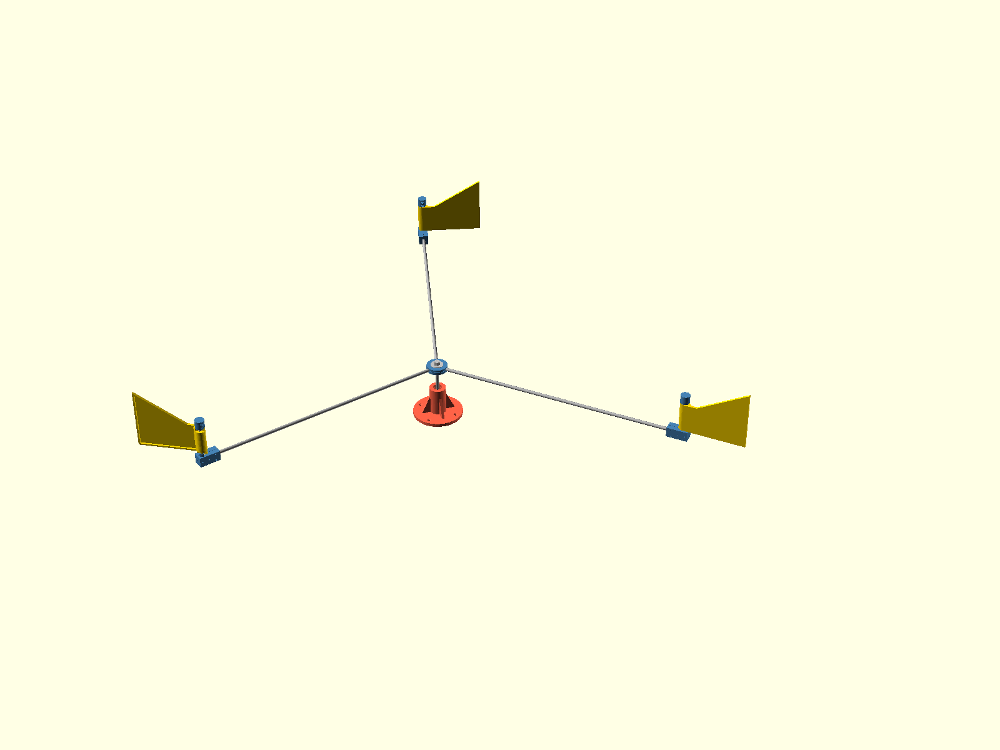

# The tri variant: consistent spin in the least wind

Skua ships in two parallel variants, each with its own release line
tagged on main:

- the DUAL: two arms, solid vanes, the mature machine (v1.0 at tag
  time). Its docs are the README and the assembly guide.
- the TRI: three arms, the light-wind variant, young (tri-v0.1
  when it first flies). This document and `cad/tri/` are its home
  while it grows; it is a sibling of the dual, not its successor,
  and both live on.

Status: concept study. Nothing under `cad/tri/` changes dual parts,
parameters or gates, and nothing from it is exported to `stl/`.

One constraint carries over from the dual: the overall span stays
close to today's sweep circle, so when vane reach grows the arms
shorten to match. Everything else is open.

The scene is `cad/tri/tri_assembly.scad`; open it in OpenSCAD to
walk around it (regen_all renders it to the image above). It shows
the tri v0.1 as currently planned: the vane, stop ring and all rod
stock are the dual's verbatim, while the hub, tip bracket and end
cap are the tri's own joints, built on one recurring idea. The tri
models use `tri_` prefixed parameters and nothing from `cad/tri/`
is exported to `stl/`.

The v0.1 recipe is deliberately minimal: the only new joint is
the hub, and the only rod prep in the whole machine is one
M8x1.25 die pass on the shaft's top end (8 mm rod is an M8 blank,
so a hand die self-aligns; no drilling, no taps, no lathe).
Everything outboard of the hub, the clamped tip bracket, stub,
stop ring and vane, is the dual's design, printed with the tri's
switches on: the ring with its fin option (`stop_ring(fin_deg)`)
and the vane with its bottom notch (`vane(bottom_notch = true)`),
because the tri's only stop is the keyed ring fin, where the dual
went the other way and kept only the cap's wedge. The other
exception is the cap: the tri clamp cap
(`cad/tri/tri_clamp_cap.scad`) is the dual's cap with the stop
wedge deleted. Three of those plus a third vane-arm set and the
hub hardware turn dual spares into a tri rotor.

## The washer-jaw hub

The hub (`cad/tri/tri_hub.scad`) went through several sizes on
the way down and landed as small as the job allows: ONE printed
spacer disc, thinner than the rod. Three full-height slots key
the arms at 120 degrees, the arms butt the boss circle and stand
proud of both faces by 0.4 mm each, and two large M8
fender washers press onto the rods from either side, clamped by
M8 nylocs on the shaft's die-threaded top end (8 mm rod is
exactly an M8 thread blank, so a hand die self-aligns and this
rod is never drilled at all; the lower nut is the shoulder, run
to the die's thread runout, and the upper one is the clamp).

The load path is worth stating: steel washer, aluminum rod, steel
washer, steel nut. No plastic sits in compression anywhere in
this joint, so unlike every clamp on the dual it does not relax
and never needs the seasonal re-torque. The disc only keys: its
slot flanks carry the arms' horizontal storm bending as bearing
over 18 mm, the washer faces square the hub on the shaft, and the
disc prints flat in minutes.

A second variant sits between this and the split hub it replaced,
modeled alongside it (`tri_hub_shell`, currently the one in the
scene): two identical thin half-shells, each a 3.6 mm half-seat
over a 2.4 mm web, cradle the arms over the full grip, and the
washers clamp the sandwich. The arms get distributed bearing top
and bottom instead of the washer rim's edge clamp, and nothing
can ever rattle; the price is those webs putting plastic back in
the clamp path, so a mild version of the dual's clamp creep
returns (low stress over a large washer footprint, and a spring
washer under each nut absorbs what little there is). Same
hardware, same print-two-of-one-part, 13 mm tall against 7. The
slot disc is the no-re-torque purist, the shells are the gentler
cradle; the bench and the water pick between them.

A structural note, recording a correction: an earlier pass
rejected male thread on the shaft, claiming the storm case fails
at the threaded exit with a safety factor near 0.7. That number
was wrong, it borrowed the ARM's root moment (about 5.8 Nm). The
shaft at the hub only carries the vane drag over the short lever
down to the top bearing, about 1 Nm at survival wind, so even on
the M8 minor section the stress is about 42 MPa against the
alloy's 160: a storm factor near four, with gust amplitudes far
below fatigue concern. The storm-critical member is and remains
the arm, unaffected by any hub choice.

Sourcing notes for the prepared rods, kept from earlier rounds:

- Tube cannot be tapped: any 8 mm tube has a bore at or above 5
  mm, already larger than the M5 thread. Solid rod only.
- Solid 8 mm rod taps easily by hand (center punch, drill 4.2 mm
  about 14 mm deep, tap M5x0.8), and dies easily by hand (chamfer
  the end, run the die). Concentricity is not critical in either
  case, because bores and steps locate the rods and the threads
  only supply axial preload.
- For kits, linear-motion suppliers sell ground 8 mm shafts with
  threaded ends as a standard catalog option, which is zero
  machining.

## The screwed stub tip (deferred kit direction)

Decided for v0.1: the tip stays the dual's clamp design verbatim,
because it is proven, already printed, and keeps taps out of the
toolchain entirely. The screwed-stub alternative below remains
modeled (`cad/tri/tri_tip_bracket.scad`,
`cad/tri/tri_end_cap.scad`) as the direction a commercial kit
would take, and waits for that round.

In that design the stub is a second prepared rod, tapped at BOTH
ends. At the bottom, the bracket's through groove becomes a plain
snug bore over a printed step: the stub drops in from above,
lands face-down on the step, and an M5 from below pulls it home,
so stub height is geometry and the bracket's stub-clamp bolt pair
is gone. At the top, a smooth wedge-free cap lands on the stub's
top face, pulled home by an M5 from above, with no angular job
and no set-at-assembly step.

The wedge-free cap rests on a field finding from the dual: two
stop faces never land exactly together, so one face takes every
hit anyway, and the stop-face gate in `performance_check` already
sizes a single face for the full dynamic impact. Both variants
now run one stop, from opposite ends of the same tradeoff: the
dual kept the CAP's wedge (adjustable angle, the field-testing
knob, at the price of setting both caps to the same rotational
sense by hand), the tri keeps the RING's fin (angle baked into
the keyed pocket, no set-at-assembly step, which is what a kit
wants). Since the dual's printable vane dropped its bottom notch
and the flag no longer sweeps the cap's airspace, the tri prints
the vane with `bottom_notch = true` and its cap bolts park
anywhere.

The tri's real own vane is the film-and-frame one further down
the ladder, which will be drawn with only the notch its fin
needs.

What the tri v0.1 needs, beyond printed parts and rod stock: two
M8 nylocs with fender washers at the hub, and the dual's own tip
hardware three times over (four M3x30 per bracket clamshell, two
M3x16 per cap, two more at the thrust collar, twenty M3s with
nylocs in all). Rod prep is the single die pass on the shaft.
The arms butt the hub's boss circle, the stop angle is keyed by
the ring pocket, and with the tri cap having no angular job the
only set-by-hand joint left is the gauged thrust collar (the dual
sets its cap wedges by hand; that is exactly the knob the tri
trades away for keyed assembly).

The dual's performance work showed what limits low-wind running
once the geometry is tuned: thrust-seat friction, vane mass, and
the two-arm torque gap. `scripts/tri_study.py` models the candidate
fixes as a cumulative ladder; run it for current numbers. The
directional findings:

- The worst parking angle of the two-arm rotor produces NEGATIVE
  torque (the wind holds it against rotation), which is the rocking
  behavior seen at low wind. Three arms at 120 degrees turn the
  worst angle into about 0.7 of mean torque; this is the single
  biggest consistency change and needs a new hub, a third arm and a
  third vane, nothing else.
- A PTFE washer on each thrust seat cuts self-start from about 1.0
  to about 0.66 m/s; film-and-frame vanes (printed perimeter,
  mylar or ripstop skin, ~28 g against 78) take it to about 0.4 and
  also fix the re-arm margin (about 70 degrees of transit against
  the 90 degree window, comfortably early).
- Holding the span while trading arm length for vane reach (500 mm
  arms, 250 mm reach) needs 10 mm arm rod, abandoning the dual's
  one-rod-stock rule, and lands self-start around 0.26 m/s with a
  better storm margin than the dual has today.
- A meter more tower height is worth about ten percent of wind at
  threshold from the boundary layer alone.

Rejected endpoint, recorded so it is not rediscovered: cup or
Savonius geometry spins earliest of all but loses the flapping and
the clack that actually scare gulls; a rotation-driven clacker
would have to be bolted on, at which point the swing-vane concept
is the simpler machine.

Build order as the tri matures toward its first release: three
arms first via the washer-jaw hub above (pure consistency, dual
vanes throughout), then washers, then film vanes, then the
reach-for-arm trade only if the water still asks for it. Further
tri ideas land here as they come.
