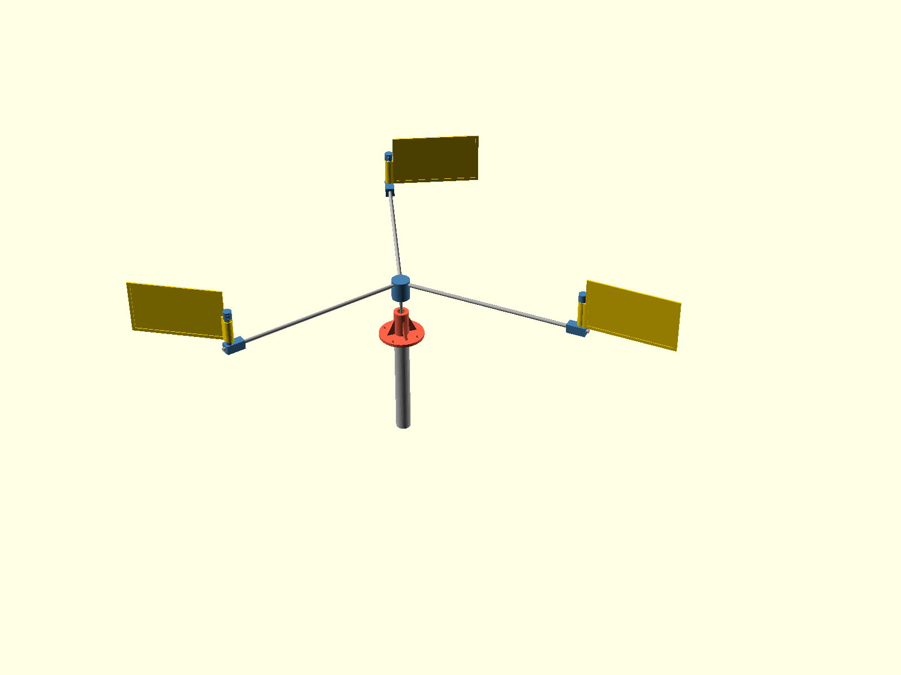

# v2.0 concept: consistent spin in the least wind

Status: study only, long-lived on the `v2` branch. Nothing here
changes v1 parts, parameters or gates. v1 ships first.

The scene is `cad/v2/v2_assembly.scad`; open it in OpenSCAD to walk
around it (regen_all renders it to the image above). The v2 models
live in `cad/v2/` with `v2_` prefixed parameters, are massing
concepts rather than printable parts, and are never exported to
`stl/`. The stub-side stack (stop ring, washer seat, end cap,
sleeve bore) is v1 verbatim, reused directly so proportions are
honest; hub and tip knuckles are placeholders.

One constraint carries over: the overall span stays close to
today's sweep circle, so when vane reach grows the arms shorten to
match. Everything else is open.

The v1 performance work showed what limits low-wind running once
the geometry is tuned: thrust-seat friction, vane mass, and the
two-arm torque gap. `scripts/v2_study.py` models the candidate
fixes as a cumulative ladder; run it for current numbers. The
directional findings:

- The worst parking angle of the two-arm rotor produces NEGATIVE
  torque (the wind holds it against rotation), which is the rocking
  behavior seen at low wind. Three arms at 120 degrees turn the
  worst angle into about 0.7 of mean torque; this is the single
  biggest consistency change and needs a new hub, a third arm and a
  third vane, nothing else.
- A PTFE washer on each thrust seat cuts self-start from about 1.0
  to about 0.66 m/s; film-and-frame vanes (printed perimeter,
  mylar or ripstop skin, ~28 g against 78) take it to about 0.4 and
  also fix the re-arm margin (about 70 degrees of transit against
  the 90 degree window, comfortably early).
- Holding the span while trading arm length for vane reach (500 mm
  arms, 250 mm reach) needs 10 mm arm rod, abandoning the v1
  one-rod-stock rule, and lands self-start around 0.26 m/s with a
  better storm margin than v1 has today.
- A meter more tower height is worth about ten percent of wind at
  threshold from the boundary layer alone.

Rejected endpoint, recorded so it is not rediscovered: cup or
Savonius geometry spins earliest of all but loses the flapping and
the clack that actually scare gulls; a rotation-driven clacker
would have to be bolted on, at which point the swing-vane concept
is the simpler machine.

Build order when v2 opens: three arms first (pure consistency, no
new materials), then washers, then film vanes, then the
reach-for-arm trade only if the water still asks for it.
